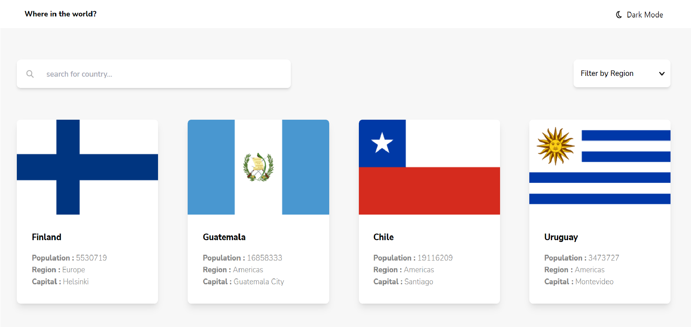

# Frontend Mentor - REST Countries API with color theme switcher solution

This is a solution to the [REST Countries API with color theme switcher challenge on Frontend Mentor](https://www.frontendmentor.io/challenges/rest-countries-api-with-color-theme-switcher-5cacc469fec04111f7b848ca). Frontend Mentor challenges help you improve your coding skills by building realistic projects. 

## Overview

### The challenge

Users should be able to:

- See all countries from the API on the homepage
- Search for a country using an `input` field
- Filter countries by region
- Click on a country to see more detailed information on a separate page
- Click through to the border countries on the detail page
- Toggle the color scheme between light and dark mode *(optional)*

### Screenshot

### Links

- Solution URL: [Add solution URL here](https://your-solution-url.com)
- Live Site URL: [Add live site URL here](https://your-live-site-url.com)

## My process

### Built with

- Semantic HTML5 markup
- CSS custom properties
- Flexbox
- CSS Grid
- [React](https://reactjs.org/) - JS library

### What I learned

I learned React Context API instead of having to use Redux. I also learned the dark-mode implementation without having to use Redux for rerendering the data.

### Continued development

I think I'll be focusing more on the context API. I didn't really assimilate all of it. I can write code using it but I didn't fully understand how it works. So, I'll be looking forward to context API.

## Author

- Website - [Elyes Saddem](https://www.elyessaddem.me)
- Frontend Mentor - [@Elyes3](https://www.frontendmentor.io/profile/Elyes3)

## Acknowledgments

You should focus on how the framework works and understand its' concepts. Trust me that's how you get better at web development.
